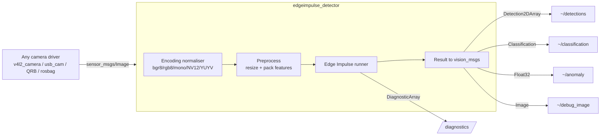

# edgeimpulse_ros

[](https://github.com/edgeimpulse/edgeimpulse-ros/actions/workflows/ci.yml)

Run [Edge Impulse](https://www.edgeimpulse.com) models in ROS 2. This package
turns an exported `.eim` model into a **camera-agnostic perception node**: it
consumes standard `sensor_msgs/Image` frames from *any* camera driver and
publishes idiomatic [`vision_msgs`](https://github.com/ros-perception/vision_msgs)
results that RViz, Foxglove and the rest of the ROS ecosystem understand.

> Rewritten from the ground up. The node no longer opens a camera directly —
> it subscribes to an image topic, which is the standard ROS perception
> pattern and lets you reuse your existing camera pipeline.

## Why this design

The previous version opened a V4L2 camera inside the node via the Edge Impulse
Linux SDK. That couples inference to one device, can't reuse an existing camera
node, and re-stamps messages with fresh timestamps (which breaks TF and sensor
fusion). This version fixes all of that:



**Highlights**

- **Camera-agnostic** — subscribe to any `sensor_msgs/Image` topic with
  configurable QoS; optional `CompressedImage` input.
- **Handles hard encodings** — decodes `bgr8`, `rgb8`, `mono8/16`, `bgra8`,
  `rgba8`, `yuyv`, `uyvy`, and **`nv12`/`nv21`** natively. This solves the
  Qualcomm QRB (`qrb_ros_camera`) NV12 conversion pain without `cv_bridge`.
- **Correct headers** — the source image `stamp` and `frame_id` are propagated
  to every output, so TF lookups and fusion keep working.
- **All image model types** — object detection, image classification, FOMO,
  and visual/scalar anomaly detection.
- **Accurate coordinates** — detections are mapped back from model input space
  to the original image resolution (crop/pad/squash aware).
- **Idiomatic messages** — `Detection2DArray`, `Classification`, plus latched
  `VisionInfo` and `LabelInfo` label metadata.
- **Diagnostics** — `diagnostic_msgs/DiagnosticArray` with FPS, latency and
  model health for `rqt_robot_monitor`.
- **Latest-frame-wins** — stale frames are dropped so slow hardware never
  builds a backlog.
- **Tested** — pure image/converter logic is covered by unit tests, plus
  `flake8`/`pep257` linters.

## Requirements

- ROS 2 **Jazzy** or **Rolling** (modern `vision_msgs` 4.x). Humble support is
  on the roadmap — the legacy `vision_msgs` fallbacks exist but aren't validated
  in CI yet.
- The Edge Impulse Linux Python SDK in the same interpreter as ROS.
- OpenCV and NumPy Python bindings.

```bash
# ROS message + tooling dependencies
sudo apt update
sudo apt install ros-$ROS_DISTRO-vision-msgs ros-$ROS_DISTRO-diagnostic-msgs \
                 python3-opencv python3-numpy portaudio19-dev

# Edge Impulse Linux SDK + pyaudio. The SDK imports `pyaudio` at load time
# (even for image models), and `portaudio19-dev` above is needed to build it.
# On Ubuntu 24.04 the system Python is "externally managed" (PEP 668), so
# install into your user site:
pip install --user --break-system-packages edge_impulse_linux pyaudio
```

> Do **not** clone `linux-sdk-python` into your workspace `src/`; colcon will
> try to build it. Install it with `pip` instead.

## Build

```bash
cd ~/ros2_ws
colcon build --packages-select edgeimpulse_ros
source install/setup.bash
```

## Quick start

Export your model from the Edge Impulse Studio (`.eim` for your target) and try
the bundled webcam demo (needs `ros-$ROS_DISTRO-v4l2-camera`):

```bash
ros2 launch edgeimpulse_ros edgeimpulse_with_camera.launch.py \
  model_path:=/absolute/path/to/model.eim \
  publish_debug_image:=true
```

Then visualise:

```bash
ros2 topic echo /edgeimpulse_detector/detections
ros2 run rqt_image_view rqt_image_view /edgeimpulse_detector/debug_image
```

## Use with your own camera

Run the node standalone and point it at an existing image topic:

```bash
ros2 launch edgeimpulse_ros edgeimpulse_detector.launch.py \
  model_path:=/path/to/model.eim \
  image_topic:=/camera/image_raw \
  image_qos:=sensor_data
```

### Qualcomm QRB / NV12 cameras

`qrb_ros_camera` publishes NV12 frames. Point the node straight at them — the
built-in decoder converts NV12 to BGR for you, no colour-conversion node
required:

```bash
ros2 launch edgeimpulse_ros edgeimpulse_detector.launch.py \
  model_path:=/path/to/model.eim \
  image_topic:=/qrb_camera/image \
  image_qos:=sensor_data
```

## Published topics

Topics are relative to the node (default namespace `/edgeimpulse_detector`).
Which result topics appear depends on the model type.

| Topic | Type | When |
| --- | --- | --- |
| `~/detections` | `vision_msgs/Detection2DArray` | object detection, FOMO, visual anomaly |
| `~/classification` | `vision_msgs/Classification` | image classification |
| `~/anomaly` | `std_msgs/Float32` | any model with anomaly (max score) |
| `~/debug_image` | `sensor_msgs/Image` | when `publish_debug_image:=true` |
| `~/vision_info` | `vision_msgs/VisionInfo` | always (latched) |
| `~/label_info` | `vision_msgs/LabelInfo` | always (latched) |
| `/diagnostics` | `diagnostic_msgs/DiagnosticArray` | when `publish_diagnostics:=true` |

Class labels are also exposed as the `class_labels` parameter, referenced by
`VisionInfo.database_location` per the `vision_msgs` convention.

## Subscribed topics

| Topic | Type | Notes |
| --- | --- | --- |
| `image_topic` (default `image`) | `sensor_msgs/Image` | when `image_transport:=raw` |
| `<image_topic>/compressed` | `sensor_msgs/CompressedImage` | when `image_transport:=compressed` |

## Parameters

| Parameter | Type | Default | Description |
| --- | --- | --- | --- |
| `model_path` | string | `""` | **Required.** Path to the `.eim` model. |
| `image_topic` | string | `image` | Input image topic. |
| `image_transport` | string | `raw` | `raw` or `compressed`. |
| `image_qos` | string | `sensor_data` | `sensor_data`, `reliable` or `default`. |
| `resize_mode` | string | `auto` | `auto`, `squash`, `fit-shortest`, `fit-longest`. `auto` uses the Studio setting. |
| `confidence_threshold` | double | `-1.0` | Minimum score to publish; `<0` uses the model's own threshold. |
| `publish_debug_image` | bool | `false` | Publish an annotated debug image. |
| `overlay_labels` | bool | `true` | Draw labels/scores on the debug image. |
| `frame_id_override` | string | `""` | Override the source image `frame_id` if non-empty. |
| `publish_diagnostics` | bool | `true` | Publish `DiagnosticArray`. |
| `diagnostic_period` | double | `1.0` | Diagnostics period (s). |
| `warn_on_drop` | bool | `false` | Log when stale frames are dropped. |
| `publish_label_info` | bool | `true` | Publish latched `LabelInfo`. |

A ready-to-edit parameter file lives in
[config/edgeimpulse_detector.yaml](config/edgeimpulse_detector.yaml):

```bash
ros2 run edgeimpulse_ros edgeimpulse_detector --ros-args \
  --params-file install/edgeimpulse_ros/share/edgeimpulse_ros/config/edgeimpulse_detector.yaml \
  -p model_path:=/path/to/model.eim
```

## Coordinate handling

Edge Impulse returns bounding boxes in the model's input resolution (e.g.
320×320). This node inverts the exact resize/crop/pad transform it applied, so
published boxes are in the **original image** pixel coordinates — ready to
project into 3D or overlay on the full-resolution frame. Set `resize_mode`
explicitly if your model was trained with a non-default resize mode.

## Diagnostics

`/diagnostics` reports effective FPS, per-frame latency, dropped-frame count,
Edge Impulse DSP/inference timings and (when present) anomaly scores. View it
with:

```bash
ros2 run rqt_robot_monitor rqt_robot_monitor
```

## Testing

```bash
colcon test --packages-select edgeimpulse_ros
colcon test-result --verbose
```

The image math and message converters are unit tested without a camera or a
model; `flake8` and `pep257` enforce style.

### Validate the NV12 path without hardware

`qrb_ros_camera` emits `nv12`. To exercise that decode path without a Qualcomm
board, publish synthetic NV12 frames with the bundled helper and point the
detector at them:

```bash
ros2 run edgeimpulse_ros nv12_test_publisher            # publishes nv12 on /image
ros2 run edgeimpulse_ros edgeimpulse_detector --ros-args \
  -p model_path:=/path/to/model.eim -p publish_debug_image:=true
ros2 run rqt_image_view rqt_image_view /edgeimpulse_detector/debug_image
```

## Troubleshooting

- **`failed to start: ... dependency "pyaudio" is missing`** — the Edge Impulse
  SDK imports `pyaudio` when it loads (even for image models). Install the
  system library and the wheel:
  `sudo apt install portaudio19-dev && pip install --user --break-system-packages pyaudio`.
- **`failed to start: The Edge Impulse Linux SDK is required at runtime`** —
  install the SDK into the interpreter ROS uses:
  `pip install --user --break-system-packages edge_impulse_linux`.
- **`failed to start: Model file ... is not executable`** — the `.eim` is a
  native binary and needs the exec bit: `chmod +x /path/to/model.eim`.
- **No messages on `~/detections`** — confirm the camera is publishing
  (`ros2 topic hz <image_topic>`) and that `image_qos` is compatible (a
  `reliable` subscriber cannot receive from a `best_effort` publisher; the
  default `sensor_data` is safe).
- **Boxes look shifted or scaled** — set `resize_mode` to match the resize mode
  configured in the Studio for your impulse.

## License

MIT. See [package.xml](package.xml).

